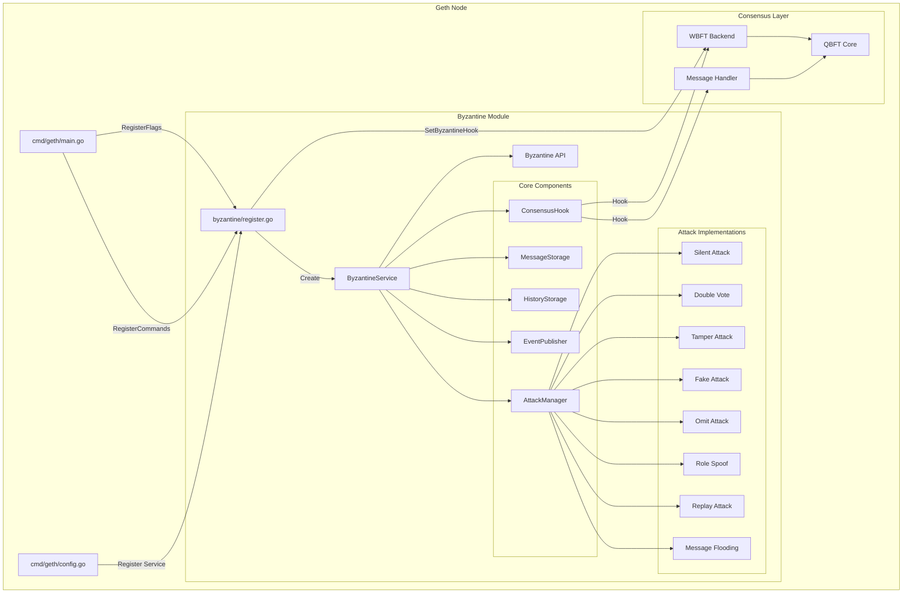
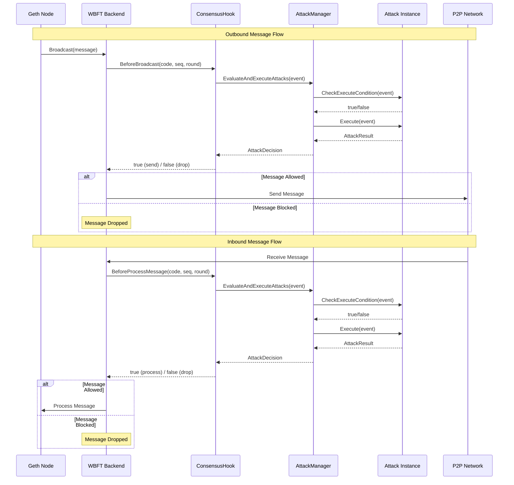
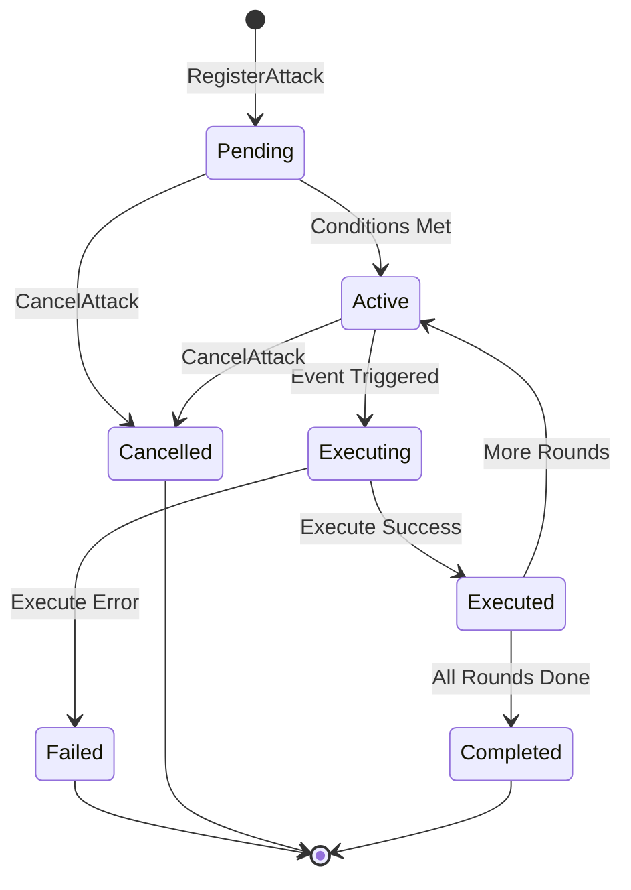
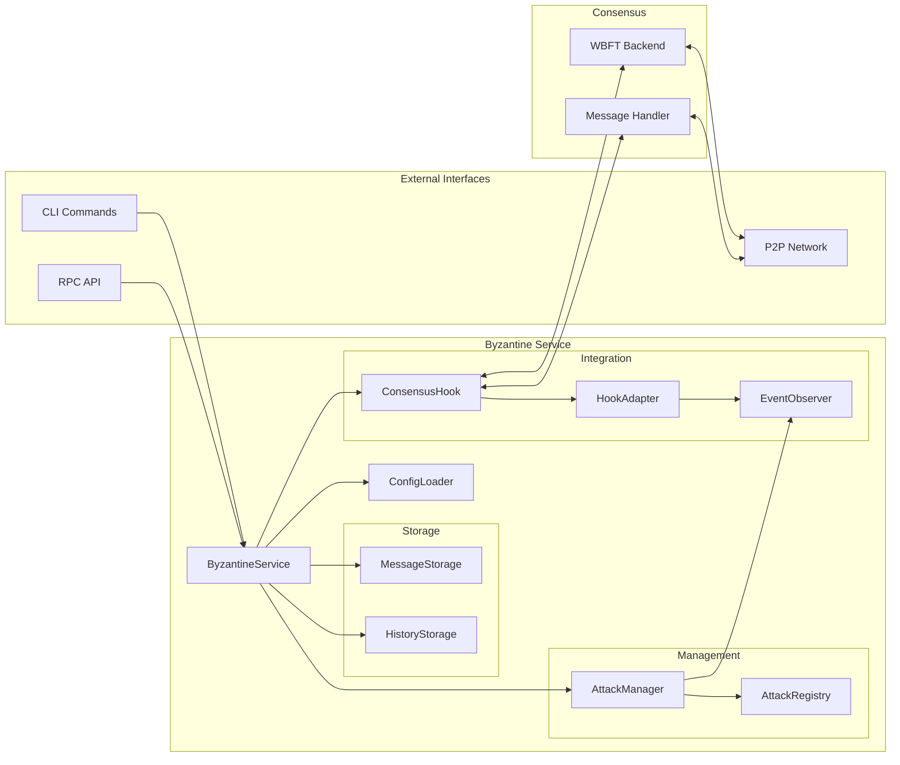
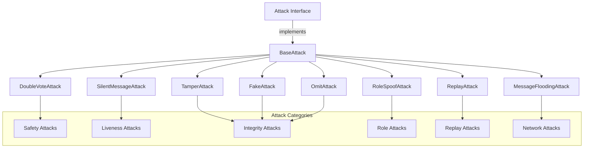
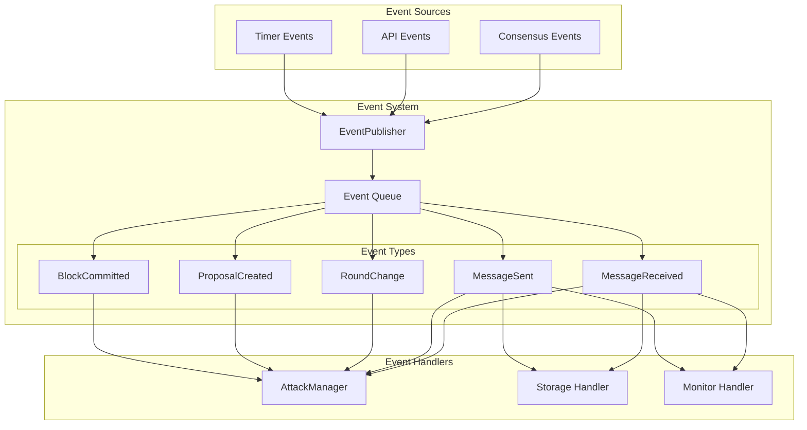
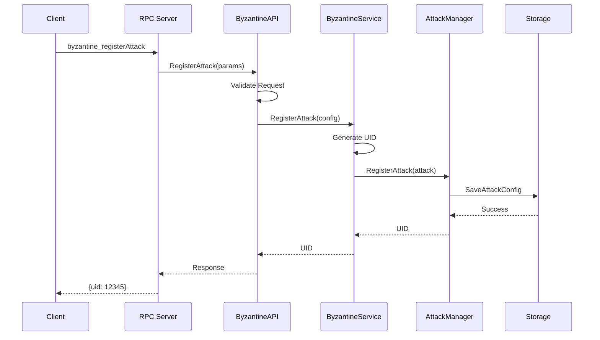
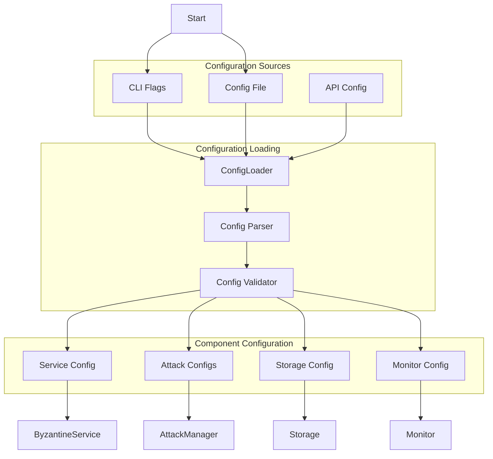
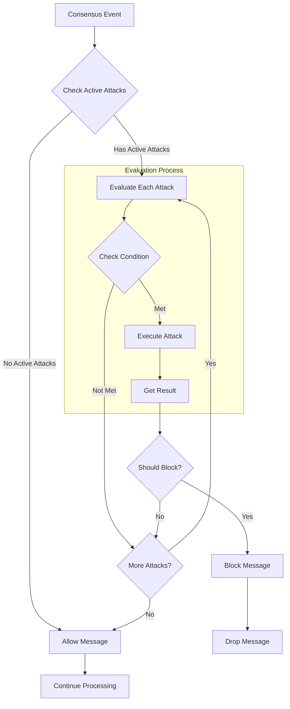

# Byzantine Module Diagrams

## 1. Module Architecture Overview

## 2. Message Flow Diagram

## 3. Attack Lifecycle State Diagram

## 4. Component Interaction Diagram

## 5. Attack Type Hierarchy

## 6. Event Flow Diagram

## 7. API Request Flow

## 8. Configuration Loading Process

## 9. Attack Decision Flow

